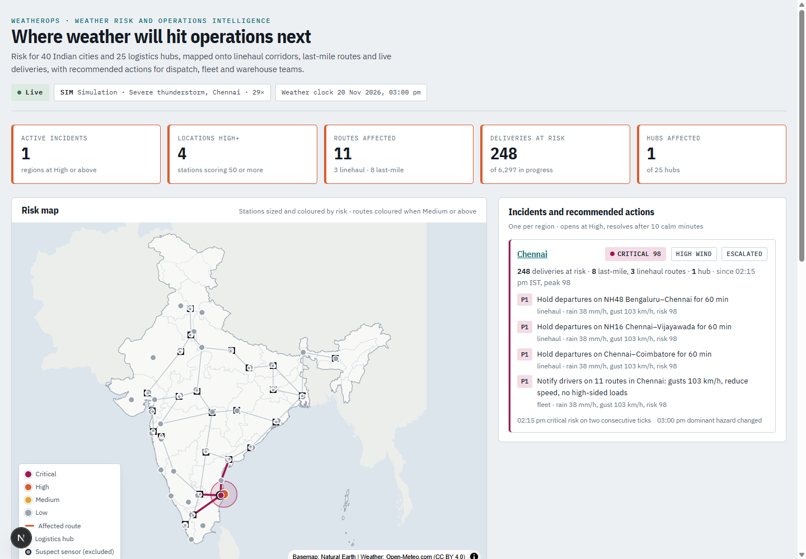

# WeatherOps

**Real-time weather risk and operations intelligence for logistics in India.**

Most weather dashboards report temperature and rainfall. WeatherOps turns them
into operational decisions for a national delivery network. For every city,
hub, route and delivery it answers four questions:

- What weather risk is developing?
- Where is it?
- Which routes, warehouses and deliveries does it touch?
- What should dispatch, fleet and warehouse teams consider doing?

**Demo:** [dashboard-eight-iota-93.vercel.app](https://dashboard-eight-iota-93.vercel.app). The
cluster runs on demand; while it is off, the page plays a recording of Cyclone Montha
(October 2025) replayed through the full pipeline.



*A severe storm crossing Chennai: the incident is Critical, the corridors out of
Chennai are flagged, and the panel lists recommended actions with the numbers
behind them.*

## What it does

- **Ingests real weather.** Open-Meteo data for 40 Indian cities, plus 111 simulated
  company sensors at 25 logistics hubs (Bhiwandi, Hoskote, Sriperumbudur, Dankuni, …).
  The sensors drift, stick, spike, drop out and send duplicates or late readings on
  purpose, so the data-quality paths always have something real to catch.
- **Processes the stream in Spark.** Spark validates readings, quarantines bad ones,
  removes duplicates, drops late data and builds 30-second windows per station.
- **Scores risk 0–100.** Rain intensity and accumulation, gusts, heat index and
  visibility are anchored on India Meteorological Department (IMD) categories. Risk
  is boosted when conditions are unusual for that city and month, and banded into
  Low, Medium, High and Critical.
- **Separates broken sensors from real weather.** A spike that a hub's other sensors
  agree with is weather. A spike only one sensor sees is a fault, and that sensor is
  kept out of the risk score.
- **Forecasts 60 minutes ahead.** LightGBM, trained on four years of history and
  judged against a "nothing changes" baseline. Regions expected to reach High within
  the hour get a pre-alert.
- **Maps risk to operations.** Risk is projected onto 33 linehaul corridors and 200
  last-mile routes. Each route shows deliveries in progress by time of day, and blocked
  corridors get reroutes where one exists.
- **Manages incidents.** One incident per region. It opens at High, escalates at
  Critical and resolves only after 10 calm minutes, so a storm hovering at the
  threshold makes one incident, not fifty alerts.
- **Recommends actions.** Examples: *pause two-wheeler dispatch (8 routes, 257
  deliveries)*, *hold NH16 departures for 60 min*, *waterlogging SOP at Sriperumbudur,
  divert inbound to Hoskote*. They come from a fixed rule table, not a chatbot.
- **Pushes changes live.** A WebSocket delivers updates to a Next.js dashboard with a
  MapLibre map of India drawn with the country's official boundary.

## Architecture

```
Open-Meteo (live + historical)
        │
ingestor ─ mode: live | replay <event> | sim <scenario>
  40 city references + 111 simulated hub sensors + fault injection
        ▼
Kafka weather-data
        ▼
Spark Structured Streaming ─┬─ raw ─────────────────────────────▶ S3 raw/
                            ├─ invalid ─▶ weather-quarantine ─────▶ S3 quarantine/
                            └─ valid → dedup → 30 s windows ─▶ weather-features ─▶ S3 features/
        ▼
risk engine, every 10 s: sensor verdicts → risk → +60 min forecast
                         → route/hub/delivery impact → incidents + actions
        ├─▶ Redis: live state + pub/sub
        └─▶ Kafka weather-decisions ─▶ S3 decisions/   (audit trail)
        ▼
FastAPI: REST snapshot + WebSocket /ws   (Traefik + Let's Encrypt)
        ▼
Next.js dashboard on Vercel   (plays a recording when the cluster is off)
```

Everything runs on one on-demand k3s node in AWS. A reading reaches the dashboard in
about 30–50 seconds: a 30-second window, 15 seconds of allowed lateness, and a
10-second engine tick. Weather affecting dispatch moves in minutes to hours, so this
is real time for the decision it supports.

| Path | What it is |
|---|---|
| `ingestor/` | Open-Meteo client, live/replay/sim sources, hub sensors, fault injection |
| `spark_processor/` | Validation, quarantine, dedup, windows, data-lake sinks, progress metrics |
| `serving/` | Risk engine (Kafka → decisions → Redis) and the REST/WebSocket API |
| `weatherops/` | Shared pure-Python logic: network, risk, anomalies, impact, incidents, actions, forecast features |
| `ml/` | History download, climatology, training, evaluation (`report.md`), committed models |
| `dashboard/` | Next.js + MapLibre front end, recording player and recorder |
| `infra/` | Terraform (EC2, Elastic IP, S3, IAM, security group), cluster bootstrap |
| `docs/superpowers/` | Design specs and implementation plans |

## How risk is scored

Each hazard gets a sub-score from 0 to 1 by interpolating between anchor points:

| Factor | Input | 0 | ≈0.5 | 1.0 | Anchored on |
|---|---|---|---|---|---|
| Rain | mm/h over the last 15 min, or 3 h accumulation + ¼ of 24 h | ≤2.5 mm/h | 15 mm/h | ≥50 mm/h | heavy rain ≥7.6 mm/h; IMD heavy 64.5 mm/day |
| Wind | gust, km/h | ≤40 | 62 | ≥118 | IMD cyclonic storm 62, very severe 118 |
| Heat | heat index, °C | ≤38 | ≈44 | ≥52 | IMD heatwave 40 / 45 / 47 °C |
| Visibility | metres | ≥2000 | ≈400 | ≤50 | IMD dense fog <200 m, very dense <50 m |

The sub-scores combine as `1 − Π(1 − s)`, so hazards compound: a cyclone's rain at
0.5 and wind at 0.5 make 75 (Critical).
- **Unusual for the place:** the score is boosted 15% when conditions pass that
  city's 95th percentile for the month, computed from the same history the model
  trains on. 20 mm/h is routine for Mumbai in July and rare in Delhi in December.
- **Categories:** Low <25, Medium <50, High <75, Critical ≥75.
- **Calibration:** all anchors sit in one table (`weatherops/risk.py`). Tests pin
  known cases: Cyclone Michaung's peak is Critical, an ordinary Mumbai monsoon hour
  is Low, Delhi at 46 °C is High.

## Broken sensor or real weather?

Every hub has 4–5 sensors a few kilometres apart. Each sensor is compared with two
things: its own last 20 windows, and the median of the other sensors at the same
hub. The statistics are robust (median and MAD).
- **Spike:** a jump that only one sensor sees.
- **Stuck:** identical values for 6 or more windows; healthy sensors always carry noise.
- **Drift:** an offset from the neighbours that keeps growing.
- **Weather:** a departure that most neighbours share.

Suspect and silent sensors are left out of risk; a hub with no trusted sensors falls
back to its city's reference data. On seeded runs with injected faults, the detector
scores ≥0.8 precision and ≥0.7 recall (`serving/tests/test_engine.py`).

## Forecasting

Four LightGBM models predict conditions 60 minutes ahead. Training data is the
Open-Meteo Historical Forecast API: 40 cities, hourly, 2022–2025, 1.4 M rows.
- **Split by time:** train 2022 to mid-2024, early-stop on late 2024, test on all
  of 2025.
- **Inputs:** only what is known at the moment of the forecast (current values,
  1–3 hour lags and changes, recent rain, time of day and year, location).
- **Parity:** a test checks that the training features and the engine's live
  features match.

Results on the 2025 test year (`ml/report.md`):

| Target | Skill vs "no change" | Shipped |
|---|---|---|
| Temperature | +54.6% | yes |
| Gust | +2.6% | yes |
| Rain | +1.7% overall; 15.6% lower error on rainy hours | yes |
| Visibility | −34% | no, the engine uses "no change" |

Early warning matters more than average error. For a city below High now, the model
correctly calls High-or-worse an hour ahead with **0.79 precision and 0.45 recall**.
The "no change" baseline catches none of these by definition.

Forecasts never raise the current score. Incidents follow what is happening, not
model error. Instead, a worse forecast marks a location as *developing* and adds a
P3 pre-alert.

**Limits:**
- One hour ahead only: the data is hourly.
- No upwind or neighbouring-city features yet.
- Trained on weather-model output, which smooths extremes.

## Data quality and pipeline health

The dashboard's health panel shows all of this. No Prometheus or Grafana is needed:
the pipeline reports its own metrics.
- **Quarantine:** invalid readings, with the reason.
- **Drops:** duplicates removed and late readings discarded, counted by Spark's
  stateful operators.
- **Gaps:** missing readings from sequence gaps, and silent sensors.
- **Throughput:** Spark batch time and Kafka backlog.
- **Freshness:** engine consumer lag, end-to-end latency (p50/p95), and how stale
  each source's data is.

## Modes

```bash
./deploy.sh --live                      # real Open-Meteo data (default)
./deploy.sh --replay montha-2025        # a historical event through the whole pipeline, 120x speed
./deploy.sh --sim storm-chennai         # synthetic scenario with known ground truth
```

Replay events were chosen by scanning four years of data for the strongest
multi-city episodes (`ml/scan_events.py`), not from memory:
- **`montha-2025`:** Cyclone Montha, Andhra coast.
- **`michaung-2023`:** Cyclone Michaung, Chennai.
- **`fog-north-2025`:** dense fog across the north.
- **`heatwave-2024`:** May 2024 heatwave.
- **`gujarat-rain-2024`:** August 2024 Gujarat rain.

Montha and the fog fall in the model's held-out year, so their forecasts are honest.

Sim scenarios: `storm-chennai`, `monsoon-mumbai`, `fog-north`, `heatwave-north`.

## Run it

**Locally (no AWS):** Kafka, Redis, ingestor, Spark, engine and API in Docker.

```bash
docker compose up -d                              # sim storm over Chennai by default
cd dashboard && echo NEXT_PUBLIC_API_HOST=localhost:8000 > .env.local && npm install && npm run dev
```

**On AWS (on-demand):**

```bash
./deploy.sh              # node, Kafka, Redis, cert-manager, topics, apps
./deploy.sh --status
./deploy.sh --tunnel     # API on http://localhost:8000 without a public name
./deploy.sh --down       # stop paying for the node; Elastic IP, S3 and IAM stay
```

The browser needs `wss://`, so the API is served over TLS by k3s's bundled Traefik
with a Let's Encrypt certificate. To enable it:
1. Create a free DuckDNS name pointing at the Elastic IP (`terraform -chdir=infra output public_ip`).
2. Run `WEATHEROPS_HOST=<name>.duckdns.org ./deploy.sh`.
3. Set `NEXT_PUBLIC_API_HOST=<name>.duckdns.org` on the Vercel project.

`--down` saves the certificate locally, so repeated bring-ups stay inside Let's
Encrypt's limit of five certificates per week.

**Tests:**

```bash
pip install -r requirements-dev.txt && pytest            # 215 tests: logic, engine end-to-end, API, ML parity
cd dashboard && npm test                                  # 12 tests: reducer, recording player, recorder
# Spark plans run inside the Spark image:
docker run --rm --user 0 -v "$PWD:/repo" -w /repo \
  -e PYTHONPATH=/opt/spark/python:/opt/spark/python/lib/py4j-0.10.9.7-src.zip:/repo \
  apache/spark:3.5.3-python3 bash -c "pip install -q pytest && python3 -m pytest spark_processor/tests"
```

**Retrain:** run `python -m ml.fetch && python -m ml.climatology && python -m ml.train`
(about 30 minutes, inside Open-Meteo's free daily quota).

## Cost

One `m7i-flex.large` node, about $0.10 an hour while it runs. `./deploy.sh --down`
destroys only the node. The Elastic IP (about $3.65 a month), the S3 data lake and
the IAM user stay. While the node is down, the Vercel dashboard plays a recording of
a real replay through the full pipeline, so the link always shows the product.

## Design choices

- **The risk engine runs after Spark, not inside it.** Neighbour checks and route
  impact need every station at once, which is natural in one Python process and
  awkward in Spark. Spark does what it is good at: windows, deduplication, late data
  and the data lake.
- **No PostgreSQL.** Redis holds live state and S3 holds history. Add a database
  when people need to acknowledge or assign incidents.
- **No Prometheus or Grafana.** The pipeline reports its own health to the panel
  that operators already look at.
- **Simple anomaly detection.** Robust statistics plus neighbour agreement are
  explainable and fast to test; IsolationForest would add opacity without adding
  signal.
- **Code ships as ConfigMaps built from the source files.** There is no image
  registry. Trained models are bigger than a ConfigMap allows, so they are copied to
  the node and mounted from there.

## Limits

- Routes are straight segments between real waypoint cities, not road geometry.
- Hub sensors and delivery volumes are simulated. The weather is real.
- One Spark driver and one engine instance; partition by region if the station count
  grows by an order of magnitude.
- Open-Meteo's free tier is for non-commercial use. A commercial deployment needs a
  paid plan or another provider.

## Credits

- Weather data by [Open-Meteo.com](https://open-meteo.com/) (CC BY 4.0).
- Basemap from [Natural Earth](https://www.naturalearthdata.com/) (public domain), using India's point-of-view boundaries.
